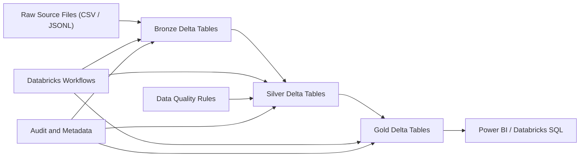

# Airline Flight Operations Lakehouse Architecture and Schema Design

## High Level Design

### Objective

Build a Databricks Lakehouse pipeline for airline flight operations analytics
that ingests raw operational and reference data, applies data quality rules,
and serves business-ready reporting tables for Power BI.

### Business Outcomes

- Measure on-time performance by airline, route, and airport
- Track departure and arrival delay patterns
- Analyze cancellations and their root causes
- Understand aircraft-level operational performance
- Correlate weather conditions with disruptions

### Source Systems

The project uses mixed-format raw sources to reflect a realistic ingestion
pattern:

- Flight operations data in CSV and JSONL
- Airport reference data in CSV and JSONL
- Aircraft reference data in CSV and JSONL
- Weather observation data in CSV and JSONL

### Logical Architecture

### Medallion Layers

#### Bronze

Purpose:
- land raw source records with minimal transformation
- preserve source lineage and replay capability
- capture ingestion metadata

Core tables:
- `airline_ops.bronze.flight_operations_raw`
- `airline_ops.bronze.airports_raw`
- `airline_ops.bronze.aircraft_reference_raw`
- `airline_ops.bronze.weather_metar_raw`

#### Silver

Purpose:
- standardize fields and timestamps
- deduplicate records
- validate key business rules
- quarantine invalid records
- derive reusable conformed entities

Core tables:
- `airline_ops.silver.flight_operations_clean`
- `airline_ops.silver.airports_clean`
- `airline_ops.silver.aircraft_reference_clean`
- `airline_ops.silver.route_reference`
- `airline_ops.silver.weather_observations_clean`
- `airline_ops.silver.flight_operations_quarantine`

#### Gold

Purpose:
- expose analytics-ready aggregates
- optimize for dashboard consumption
- reduce downstream model complexity

Core tables:
- `airline_ops.gold.on_time_performance_daily`
- `airline_ops.gold.route_delay_summary`
- `airline_ops.gold.airport_delay_summary`
- `airline_ops.gold.cancellation_summary`
- `airline_ops.gold.aircraft_performance_summary`

### End-to-End Flow

1. Raw CSV and JSONL files land in storage.
2. Bronze ingests raw records into Delta tables.
3. Silver cleans, validates, standardizes, and enriches data.
4. Gold aggregates the cleaned data into reporting marts.
5. Power BI connects to Gold tables for dashboards.

### Non-Functional Design

- Delta Lake for ACID storage and scalable updates
- partitioning on large fact-style tables by `year_month` or `flight_date`
- traceability through `batch_id`, `source_file_name`, and `record_hash`
- extensible schema for future streaming or API ingestion

## Low Level Design

### 1. Bronze Layer Design

#### `flight_operations_raw`

Grain:
- one record per flight movement event per flight date

Key raw attributes:
- airline, flight number, tail number
- origin and destination airports
- scheduled and actual departure and arrival times
- delay and cancellation measures
- ingestion metadata

Technical design:
- Delta table partitioned by `year_month`
- accepts both CSV and JSONL raw feeds
- preserves `raw_record` as an auditable payload snapshot

#### `airports_raw`

Grain:
- one record per airport reference row

Purpose:
- supply airport code validation and descriptive attributes for reporting

Technical design:
- small reference table
- no partitioning required

#### `aircraft_reference_raw`

Grain:
- one record per aircraft type reference row

Purpose:
- enrich flight records with aircraft type metadata

#### `weather_metar_raw`

Grain:
- one record per station observation timestamp

Purpose:
- enrich operations data with weather conditions near departure or arrival

Technical design:
- partition by `observation_date`

### 2. Silver Layer Design

#### `flight_operations_clean`

Grain:
- one cleaned record per flight operation

Transformations:
- convert HHMM strings into timestamps
- standardize airport codes to uppercase
- cast delay measures into integer columns
- derive `route_code`
- derive `cancelled_flag`, `diverted_flag`, `is_delayed_flag`
- derive on-time flags for departure and arrival
- retain ingestion metadata for traceability

Validation rules:
- `flight_number` must not be null
- `origin_airport` and `dest_airport` must exist and differ
- scheduled arrival must be later than scheduled departure unless date roll is handled
- cancelled flights may have null actual timestamps
- non-cancelled flights should have actual timestamps and usable delay values

Output handling:
- valid records go to `flight_operations_clean`
- invalid records go to `flight_operations_quarantine`

#### `airports_clean`

Transformations:
- keep airports with valid IATA or ICAO values
- normalize flags and text casing
- expose airport location attributes for joins

#### `aircraft_reference_clean`

Transformations:
- deduplicate aircraft codes
- standardize aircraft identifiers for reporting joins

#### `route_reference`

Derived from:
- distinct origin and destination pairs from `flight_operations_clean`

Purpose:
- give a reusable route dimension for reporting and governance

#### `weather_observations_clean`

Transformations:
- normalize weather timestamps and categories
- keep weather measures in typed fields for joins and analytics

### 3. Gold Layer Design

#### `on_time_performance_daily`

Grain:
- one row per `flight_date` and `reporting_airline`

Measures:
- total flights
- completed flights
- cancelled flights
- delayed departure and arrival counts
- on-time percentages
- average delay measures

#### `route_delay_summary`

Grain:
- one row per `flight_date`, route, and airline

Measures:
- route-level delay trends
- max arrival delay
- counts of cancellations and delayed arrivals

#### `airport_delay_summary`

Grain:
- one row per `flight_date`, airport, airport role, and airline

Measures:
- departure-side or arrival-side airport performance
- airport-level delay and cancellation analysis

#### `cancellation_summary`

Grain:
- one row per `flight_date`, airline, route, and cancellation reason

Measures:
- cancellation counts by reason category

#### `aircraft_performance_summary`

Grain:
- one row per `flight_date`, tail number, and airline

Measures:
- aircraft-specific delay and completion performance

### 4. Orchestration Design

Recommended Databricks Workflow sequence:

1. ingest raw flights to Bronze
2. ingest raw airports to Bronze
3. ingest raw aircraft reference to Bronze
4. ingest raw weather observations to Bronze
5. transform Bronze to Silver
6. load quarantine records
7. aggregate Silver to Gold
8. refresh Power BI semantic model or Databricks SQL dashboard

### 5. Power BI Model Guidance

Recommended dataset sources:
- `gold.on_time_performance_daily`
- `gold.route_delay_summary`
- `gold.airport_delay_summary`
- `gold.cancellation_summary`
- `gold.aircraft_performance_summary`

Suggested report pages:
- Executive overview
- On-time performance
- Route delays
- Airport delays
- Cancellations
- Aircraft performance

### 6. Data Quality and Audit Strategy

Audit metadata captured from Bronze onward:
- `batch_id`
- `source_file_name`
- `record_hash`
- `ingestion_timestamp`

Primary controls:
- null checks
- duplicate checks
- valid airport checks
- logical timestamp sequence checks
- cancellation reason checks
- row-count reconciliation between layers

### 7. Scope Fit

This design is intentionally realistic but still manageable for a 1 YOE data
engineering portfolio project:

- enough raw variation for Bronze, Silver, and Gold
- enough dimensional structure for proper analytics
- enough operational realism to discuss design choices in interviews
